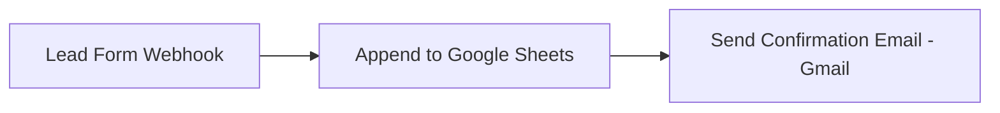

# 📨 Automated Lead Capture & Notification System

An **n8n workflow automation** that instantly captures leads submitted through a web form, logs them in Google Sheets, and sends an automatic confirmation email — all without any manual intervention.

---

## 📋 Overview

Businesses and websites regularly receive enquiries through contact or lead-generation forms. Manually checking submissions, recording them for follow-up, and replying to each person individually is slow and easy to overlook.

This project uses a **webhook-triggered n8n workflow** to:

1. Receive lead data the instant a form is submitted
2. Log it into a Google Sheet for record-keeping
3. Automatically send the lead a personalised confirmation email

---

## 🔄 Workflow



| Step | Node | Function |
|------|------|----------|
| 1 | **Lead Form Webhook** | Listens for an incoming `POST` request (e.g. from a website contact form) and captures Name, Email, and Message. |
| 2 | **Append to Google Sheets** | Adds the lead's details as a new row — Name, Email, Message, and a formatted Submission Date/Time. |
| 3 | **Send a Message (Gmail)** | Sends a personalised confirmation email back to the lead, thanking them for reaching out. |

---

## 🚀 Features

- ⚡ **Real-time, event-driven** — triggers instantly on form submission (no polling delay)
- 📊 **Centralized lead log** automatically maintained in Google Sheets
- 📧 **Personalised auto-reply** email sent to every lead immediately
- 🧩 **No-code workflow** — easy to extend with more steps (Slack/Telegram alerts, CRM sync, etc.)

---

## 🛠️ Tech Stack

- [n8n](https://n8n.io) (Cloud) — workflow automation platform
- **Webhook** (HTTP POST) — entry point for lead data
- **Google Sheets API** — lead data storage
- **Gmail (OAuth2)** — automated email replies

---

## 📁 Repository Structure

```
├── lead-to-sheet-email-telegram.json   # n8n workflow export (importable)
├── lead_test_form_v2.html              # Simple HTML form to test the webhook
└── README.md
```

---

## 🔧 Setup & Installation

1. **Import the workflow**
   - In n8n, create a new workflow → menu (⋮) → *Import from File* → select `lead-to-sheet-email-telegram.json`

2. **Connect Google Sheets**
   - Create a Google Sheet with columns: `Name | Email | Message | SubmittedAt`
   - In the **Append to Google Sheets** node, connect your Google account and select the sheet

3. **Connect Gmail**
   - In the **Send a Message** node, connect your Gmail account (OAuth2)
   - Update the `To`, `Subject`, and `Message` fields as needed

4. **Publish the workflow**
   - Click **Publish** in n8n to activate the webhook in production

5. **Copy your webhook URL**
   - Open the **Lead Form Webhook** node → copy the **Production URL**
   - It will look like: `https://<your-instance>.app.n8n.cloud/webhook/lead`

---

## 🧪 Testing

Use the included `lead_test_form_v2.html` to simulate a real form submission:

1. Open the file in a browser
2. Fill in Name, Email, and Message
3. Click **Submit Test Lead**
4. Check your Google Sheet and inbox — both should update instantly

You can also test with `curl`:

```bash
curl -X POST https://<your-instance>.app.n8n.cloud/webhook/lead \
  -H "Content-Type: application/json" \
  -d '{"name":"Test User","email":"you@example.com","message":"Hello!"}'
```

---

## 🔮 Future Improvements

- 🔔 Team notifications via Slack or Telegram when a new lead arrives
- ✅ Email format validation before processing
- 🗂️ Integration with a CRM system for advanced lead management
- 🛡️ Spam/bot protection on the incoming webhook

---

## 📄 License

This project is free to use and modify for educational or personal purposes.
